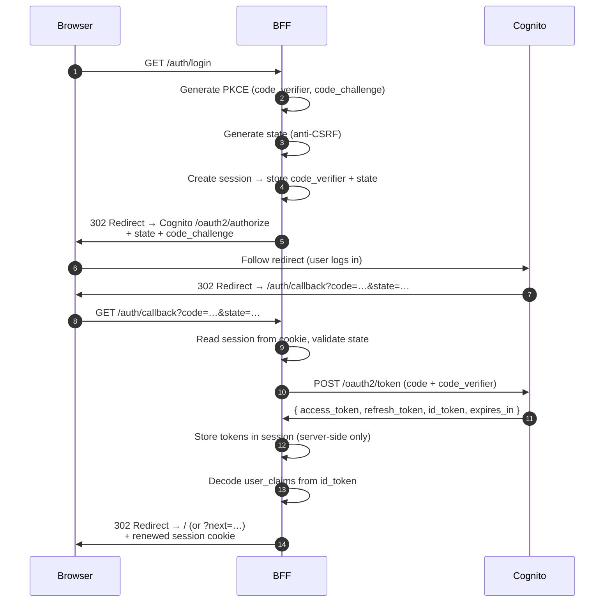
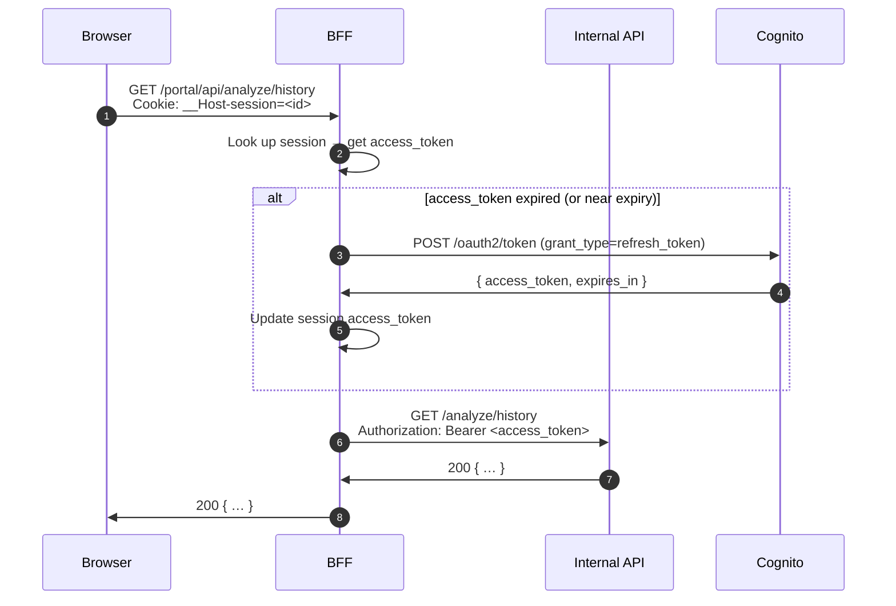

# BFF Flow Documentation

Portal Backend-for-Frontend (BFF) — Authentication, Session, and Token Delegation.

**Issue:** #806 (BFF-0) · Implemented in WPs #850–#854

---

## 1. Architecture Overview

The BFF sits between the Portal SPA (browser) and the internal REST API.
The browser **never** sees any OIDC token. Only an opaque, httpOnly session cookie
is sent to the browser. The BFF exchanges it for the real access token when calling
the downstream API.

```
Browser  ──(session cookie)──►  BFF  ──(Bearer access_token)──►  Internal API
                                  │
                          ◄──(ID/Access/Refresh tokens)──  Cognito
```

---

## 2. Login Flow (OIDC Auth Code + PKCE)



**Key security points:**
- PKCE `code_verifier` is generated server-side, stored in the BFF session,
  and never sent to the browser.
- `state` parameter prevents CSRF on the callback.
- Tokens are stored exclusively in the BFF session store (in-memory).
  The browser receives only a `session_id` in an httpOnly, Secure, SameSite=Lax
  cookie.

---

## 3. Session Cookie Lifecycle

| Event | Cookie action |
|---|---|
| `GET /auth/login` | New session created; `Set-Cookie: __Host-session=<id>; HttpOnly; SameSite=Lax; Path=/` |
| `GET /auth/callback` | Cookie renewed (same ID, refreshed Max-Age) |
| `GET /me` | Cookie read; no change |
| `GET /portal/api/*` | Cookie read; token auto-refreshed if near expiry |
| `POST /auth/logout` | `Set-Cookie: __Host-session=deleted; Max-Age=0; …` |
| Session TTL exceeded | Session evicted on next access; client gets 401 |

**Cookie attributes:**

```
__Host-session=<opaque-id>
Max-Age=3600         (configurable via BFF_SESSION_TTL_SECONDS)
Path=/
HttpOnly             (JS cannot read)
SameSite=Lax         (auth redirect flow)
Secure               (HTTPS only; override with BFF_SESSION_SECURE_COOKIE=0 for local dev)
```

The `__Host-` prefix enforces `Secure` + `Path=/` at the browser level (additional protection).
Runtime guardrails:
- Session-ID values are validated against a strict token charset before writing/reading cookies.
- Invalid cookie names fall back to `__Host-session`.
- If `Secure` is disabled for local HTTP dev, `__Host-*` names auto-downgrade to `bff-session` to prevent browser-side cookie rejection.

---

## 4. Token Delegation Path

When the portal SPA calls `GET /portal/api/*`, the BFF:



For state-changing requests (`POST /portal/api/*`), the CSRF custom-header check
is enforced **before** the proxy call:

- Browser must send `X-BFF-CSRF: 1` (configurable).
- Cross-origin requests cannot set custom headers → natural CSRF barrier.
- Cookie `SameSite=Strict` is set for portal-proxy session cookies as an additional layer.

---

## 5. Logout Flow

```mermaid
sequenceDiagram
    autonumber
    participant B  as Browser
    participant BF as BFF
    participant C  as Cognito

    B  ->> BF: POST /auth/logout<br/>X-BFF-CSRF: 1
    BF ->> BF: session_store.delete(session_id)
    BF ->> B : Set-Cookie: __Host-session=deleted; Max-Age=0
    alt Cognito logout endpoint configured
        BF ->> B : 302 → Cognito /logout?client_id=…&logout_uri=…
        B  ->> C : Follow redirect (Cognito invalidates tokens server-side)
    else No Cognito endpoint
        BF ->> B : 204 (local session cleared only)
    end
```

---

## 6. Environment Variables

All BFF env vars are optional by default (BFF OIDC is disabled when `BFF_OIDC_ISSUER` is unset).

| Variable | Required | Example | Description |
|---|---|---|---|
| `BFF_OIDC_ISSUER` | Yes (to enable BFF) | `https://cognito-idp.eu-central-1.amazonaws.com/eu-central-1_XXXXX` | OIDC issuer URL. Setting this enables the BFF OIDC flow. |
| `BFF_OIDC_CLIENT_ID` | Yes | `3abc123xyz` | Cognito App Client ID. |
| `BFF_OIDC_CLIENT_SECRET` | No | *(empty)* | Client secret for confidential clients. Leave empty for PKCE-only (public) clients. |
| `BFF_OIDC_REDIRECT_URI` | Yes | `https://myapp.example.com/auth/callback` | Callback URL registered in the Cognito App Client. |
| `BFF_OIDC_SCOPES` | No | `openid email profile` | Space-separated OAuth 2.0 scopes. Default: `openid email profile`. |
| `BFF_OIDC_AUTH_ENDPOINT` | No | `{ISSUER}/oauth2/authorize` | Authorization endpoint override. Default: `{BFF_OIDC_ISSUER}/oauth2/authorize`. |
| `BFF_OIDC_TOKEN_ENDPOINT` | No | `{ISSUER}/oauth2/token` | Token endpoint override. Default: `{BFF_OIDC_ISSUER}/oauth2/token`. |
| `BFF_OIDC_LOGOUT_ENDPOINT` | No | `{ISSUER}/logout` | Logout endpoint override. Default: `{BFF_OIDC_ISSUER}/logout`. |
| `BFF_OIDC_NEXT_PARAM_ALLOW_SAME_ORIGIN` | No | `1` | Allow `?next=<path>` redirect after login. Set `0` to disable. Default: `1`. |
| `BFF_SESSION_COOKIE_NAME` | No | `__Host-session` | Session cookie name. Default: `__Host-session` (requires Secure + Path=/). Invalid names are rejected and fall back to default. |
| `BFF_SESSION_TTL_SECONDS` | No | `3600` | Session lifetime in seconds. Default: 3600 (1 hour). |
| `BFF_SESSION_SECURE_COOKIE` | No | `1` | Set `0` to disable `Secure` flag (local dev only). If cookie name uses `__Host-`, runtime auto-downgrades to `bff-session` to avoid invalid host-prefix cookies over HTTP. |
| `BFF_PORTAL_API_BASE_URL` | Yes (for proxy) | `http://localhost:8080` | Base URL of the internal API for portal proxy forwarding. |
| `BFF_CSRF_HEADER_NAME` | No | `X-BFF-CSRF` | Custom CSRF header name. Default: `X-BFF-CSRF`. |
| `BFF_CSRF_HEADER_VALUE` | No | `1` | Expected CSRF header value. Default: `1`. |
| `BFF_API_CALL_TIMEOUT_SECONDS` | No | `10` | Timeout in seconds for downstream API calls. Default: `10`. |

---

## 7. Cognito App Client Configuration

When registering the BFF in Cognito:

1. **App Type:** Confidential client (if `BFF_OIDC_CLIENT_SECRET` is set) or Public client (PKCE-only).
2. **Allowed OAuth Flows:** Authorization Code Grant ✅
3. **Allowed OAuth Scopes:** `openid`, `email`, `profile` (match `BFF_OIDC_SCOPES`)
4. **Callback URLs:** Add exactly `BFF_OIDC_REDIRECT_URI` (e.g. `https://myapp.example.com/auth/callback`)
5. **Sign-out URLs:** Add the post-logout redirect URI (e.g. `https://myapp.example.com/`)
6. **PKCE:** Cognito enforces PKCE for public clients automatically; for confidential clients it is optional but the BFF always sends `code_challenge`.

**Staging callback URL example:**
```
https://staging.geo-ranking-ch.example.com/auth/callback
```

**Local dev callback URL example (add to Cognito dev App Client):**
```
http://localhost:8080/auth/callback
```

---

## 8. BFF Module Files

| File | Purpose |
|---|---|
| `src/api/bff_session.py` | Session store, cookie helpers (WP1 / #850) |
| `src/api/bff_oidc.py` | OIDC Auth Code + PKCE login/callback handlers (WP2 / #851) |
| `src/api/bff_token_delegation.py` | Token auto-refresh, `/me`, `/auth/logout`, `bff_api_call` (WP3 / #852) |
| `src/api/bff_portal_proxy.py` | Portal proxy, CSRF check, cookie security, log redaction (WP4 / #853) |

**Tests:**

| File | Tests | Issue |
|---|---|---|
| `tests/test_bff_session.py` | 45 | #850 |
| `tests/test_bff_oidc.py` | 61 | #851 |
| `tests/test_bff_token_delegation.py` | 32 | #852 |
| `tests/test_bff_portal_proxy.py` | 51 | #853 |
| `tests/test_bff_integration.py` | integration smoke | #854 |

---

## 9. Security Checklist

- [x] Tokens **never** sent to browser (stored in BFF session only)
- [x] Session cookie: httpOnly, Secure, SameSite=Lax (auth flow) / Strict (proxy)
- [x] `__Host-` cookie prefix enforces Secure + Path=/ at browser level
- [x] PKCE `code_verifier` generated server-side, cleared after callback
- [x] `state` parameter validates CSRF on callback
- [x] CSRF custom-header check on all state-changing portal endpoints
- [x] `Authorization: Bearer` header never forwarded from browser; injected by BFF
- [x] Session cookie not forwarded to downstream API
- [x] Token values redacted in all log output (`safe_log`, `redact_authorization_header`)
- [x] Refresh token failure → session deleted → 401 (forces re-login)
- [x] TLS detection via `X-Forwarded-Proto` / `X-Forwarded-Ssl` for dynamic `Secure` flag
