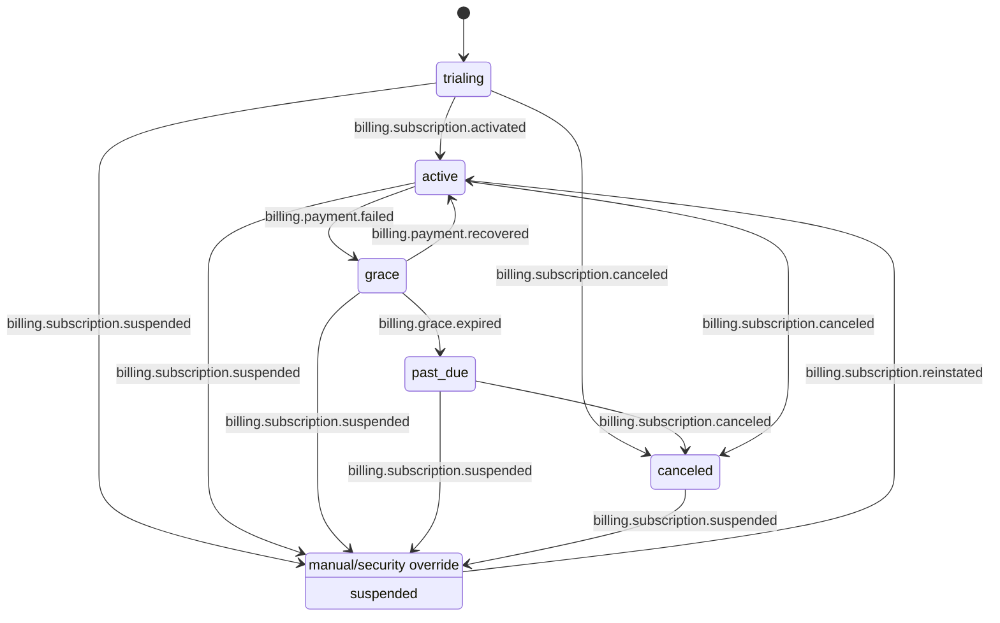

# Billing-/Subscription-Lifecycle v1

> **Zweck:** Normative State-Machine + Transition-Matrix für Billing/Subscription inkl. Entitlement-Effects,
> sodass DB-/Domain-Modelle und Webhook-/Event-Handler eindeutig ableitbar sind.
>
> **Kanonische Referenz (Entitlements + API-Statusfelder):** [`docs/api/entitlements-v1.md`](api/entitlements-v1.md)
> 
> **Historischer Detail-Hintergrund (bleibt aus Test-/Nachvollziehbarkeitsgründen erhalten):**
> [`docs/api/entitlement-billing-lifecycle-v1.md`](api/entitlement-billing-lifecycle-v1.md)

Stand: 2026-03-01  
Issue: #628 (Parent #577)

---

## 0) Begriffe & Scope

- **Plan**: GTM-/Pricing-Definition (z. B. `free|pro|business`) – „Baseline“ für Limits/Capabilities.
- **Subscription**: technisch/DB-seitig der aktive (oder historisierte) Vertrags-/Zahlungszustand pro Org.
- **Lifecycle-State**: kanonischer Runtime-/Domain-Zustand (`trialing|active|grace|past_due|canceled|suspended`).
- **Entitlements/Capabilities**: effektive, zur Laufzeit auswertbare Gates (siehe `docs/api/entitlements-v1.md`).

Nicht-Ziele dieses Dokuments:
- Provider-spezifische Implementation-Details (Stripe etc.) – nur Mapping auf **interne Events**.
- Finales Invoice-/Tax-Design.

---

## 1) Kanonische Zustände (v1)

| State | Beschreibung | Analyze-Verhalten (Default) | Entitlement-Wirkung (Default) |
| --- | --- | --- | --- |
| `trialing` | Testphase aktiv | normal | Trial-Limits (kann enger als Pro sein) |
| `active` | regulär bezahlt/aktiv | normal | Plan-Limits (Baseline) |
| `grace` | Zahlungsproblem mit Schonfrist | normal mit Hinweis | Plan-Limits **oder** gedrosselt (fail-safe möglich) |
| `past_due` | über Grace hinaus offen | eingeschränkt möglich | konservativer Fallback (z. B. Free-Limits) |
| `canceled` | gekündigt/beendet | Free-Scope | Rückfall auf Free |
| `suspended` | manuelle Sperre (Compliance/Security) | blockiert/streng limitiert | minimale/keine Capabilities |

**Prioritätsregel:** `suspended` ist ein **hartes Override** und schlägt Billing-Recovery,
solange keine explizite `reinstated`-Freigabe erfolgt.

---

## 2) State-Machine (Mermaid)

Hinweis: Der Pfeil `suspended -> active` ist absichtlich „unspezifisch“.
Die Reinstatement-Logik kann je nach Billing-Stand auch `grace` ergeben (siehe Transition-Matrix).

---

## 3) Transition-Matrix (Trigger → DB-Update → Entitlement-Effect)

**Konventionen:**
- Jede Transition wird über ein **internes, kanonisches Event** ausgelöst (unabhängig vom Provider).
- Jeder Handler ist **idempotent** und **out-of-order-safe** (siehe Abschnitt 4).

| From | Internes Event | To | DB-Update (minimum) | Entitlement-Effect (minimum) |
| --- | --- | --- | --- | --- |
| *(none)* | `billing.subscription.created` | `trialing` oder `active` | `subscriptions.insert(...)` + `plan_id`/`plan_tier` setzen | Baseline entitlements initialisieren |
| `trialing` | `billing.subscription.activated` | `active` | `subscriptions.state=active` | Wechsel Trial→Plan-Baseline |
| `active` | `billing.subscription.upgraded` | `active` | `subscriptions.plan_id` aktualisieren (atomar) | Limits/Capabilities erhöhen (keine Downgrade-Semantik!) |
| `active` | `billing.subscription.downgraded` | `active` | `subscriptions.plan_id` aktualisieren (atomar) | Limits reduzieren; optional „overage“ markieren |
| `active` | `billing.payment.failed` | `grace` | `subscriptions.state=grace`, `grace_until` setzen | Default: weiter Plan-Limits; optional Dämpfung (fail-safe) |
| `grace` | `billing.payment.recovered` | `active` | `subscriptions.state=active`, `grace_until=NULL` | zurück auf Plan-Limits |
| `grace` | `billing.grace.expired` | `past_due` | `subscriptions.state=past_due` | konservativer Fallback (z. B. Free) |
| `past_due` | `billing.subscription.canceled` | `canceled` | `subscriptions.state=canceled`, `canceled_at` setzen | Fallback auf Free (keine Premium-Capabilities) |
| `active` | `billing.subscription.canceled` | `canceled` | `subscriptions.state=canceled`, `canceled_at` setzen | Fallback auf Free |
| `*` | `billing.subscription.suspended` | `suspended` | `subscriptions.state=suspended`, `suspended_at` setzen | harte Sperre: minimale/keine Capabilities |
| `suspended` | `billing.subscription.reinstated` | `active` oder `grace` | `subscriptions.state={active|grace}` | abhängig vom Billing-Stand; nie automatisch „besser“ als vorher |

**Regel für nicht erlaubte Übergänge:**
- Wenn `from_state` nicht zum DB-ist-Stand passt, wird das Event **nicht** angewendet.
- Stattdessen: persistierte Audit-/Anomalie-Notiz + (optional) „quarantine/reconcile“-Pfad.

---

## 4) Idempotenz, Ordering & Replay (verbindlich)

Minimalanforderungen (Details siehe `docs/api/entitlements-v1.md`):

1. **Dedup-Key:** `provider:<provider_name>:event_id:<event_id>`
2. **Persistierter Verarbeitungsnachweis** pro Event:
   - `received_at`, `processed_at`, `state_before/after`, `status`, optional `result_hash`
3. **Ordering:** ältere Events dürfen keinen neueren Zustand überschreiben.
4. **Replay:** wiederholte Zustellung ist erlaubt und führt deterministisch zum selben Endzustand (no-op bei Duplicate).

---

## 5) Offene Punkte / bewusstes „Nicht-Festlegen“

- Provider-spezifisches Mapping (Stripe-Events etc.) ist **nur** als Input auf interne Events zu verstehen.
- Invoicing/Tax/Payment-Method Details sind bewusst offen.
- Ob `grace` schon dämpft oder nicht (Rate-Limit/Quota) hängt von Fraud-/Kostenlage ab; Default bleibt „normal mit Hinweis“.

---

## 6) Next Steps (Folge-Issues / Umsetzung)

- Umsetzung der Domain-/DB-Strukturen folgt dem kanonischen Modell in:
  - [`docs/GTM_TO_DB_ARCHITECTURE_V1.md`](GTM_TO_DB_ARCHITECTURE_V1.md)
  - [`docs/DATA_MODEL_v1.md`](DATA_MODEL_v1.md)
  - [`docs/api/entitlements-v1.md`](api/entitlements-v1.md)

