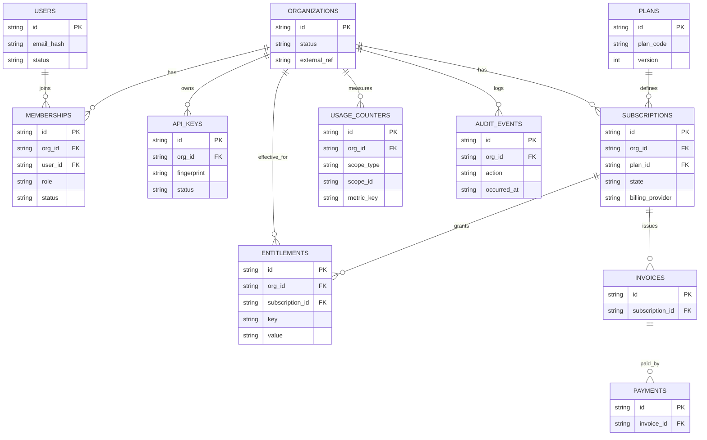

# Data Model v1 — Multi-Tenant Core (Org/User/Billing/Entitlements)

Stand: 2026-03-01  
Issue: #626 (Parent: #577)

> **Zweck:** Dieses Dokument beschreibt das **logische Datenmodell v1** für die GTM-/Monetization-Domain (Org/User, Plans/Subscriptions, Entitlements, Usage, API-Keys, Audit).  
> Es ist **Design-First** und bewusst **implementationsneutral** (DB-Engine/Provider-Details folgen in späteren Umsetzungs-Issues).

## 0) Kontext / Einordnung

- Kanonischer GTM-Kontext: [`docs/GTM.md`](GTM.md) → Abschnitt „GTM → Data Architecture Mapping (v1)“.
- Billing-/Entitlement-Lifecycle: [`docs/api/entitlement-billing-lifecycle-v1.md`](api/entitlement-billing-lifecycle-v1.md).
- Async Analyze Domain (separater Cluster, eigenes Schema): [`docs/api/async-analyze-domain-design-v1.md`](api/async-analyze-domain-design-v1.md) + `docs/sql/async_jobs_schema_v1.sql`.

**Wichtig (Dev-Realität):** Gemäß [`docs/SECURITY.md`](SECURITY.md) ist `dev` aktuell **stateless** (keine persistente DB). Dieses Datenmodell ist die **Zielstruktur** für spätere Persistenz (z. B. für Billing/Entitlements/Audit), nicht zwingend sofortiger Implementationsauftrag.

## 1) Design-Prinzipien (v1)

1. **Org ist Primär-Tenant** (härteste Datengrenze). Datenzugriff erfolgt immer im Kontext `org_id`.
2. **AuthN ≠ AuthZ:** User kann sich authentisieren, Zugriff entsteht erst durch `membership`.
3. **Additive Evolution:** neue Felder/Keys sind additive Änderungen; keine Breaking Contracts.
4. **Deterministische Gate-Evaluation:** Entitlements/Capabilities sind maschinenlesbar, auditierbar, ohne „hidden global state“.
5. **Idempotenz-Realität (Billing):** Provider-Events können mehrfach/out-of-order kommen → Persistenz braucht Idempotenz-Schlüssel und Append-only/Audit-Strategien.

## 2) Tenant-Grenzen & Ownership (normativ)

- **Tenant-Owned Tables** tragen **direkt** `org_id` (z. B. `api_keys`, `subscriptions`, `entitlements`, `usage_*`, `audit_events`).
- **Global Tables** (z. B. `users`, `plans`) sind entweder:
  - *global* (kein `org_id`), oder
  - *namespaced* (z. B. `plan_code` + `version`).
- **Transitive Ownership** ist zulässig, wenn die Org-Grenze eindeutig ableitbar ist (z. B. `memberships.user_id` ist global, aber `memberships.org_id` ist der Tenant-Anker).

> Guardrail: Jeder produktive Read/Write-Pfad muss **entweder** direkt `org_id` filterbar machen **oder** über einen FK-Pfad eindeutig auf `org_id` zurückführen.

## 3) Kern-Entitäten (logisch) + Constraints/Indizes

Die folgende Spezifikation ist **logisch** (Spaltennamen als Vorschlag). Konkrete Typen (UUID/ULID, JSONB etc.) werden bei Implementierung festgezurrt.

### 3.1 `organizations`
**Zweck:** kanonischer Tenant.

**Vorschlagsfelder:**
- `id`
- `name` (optional)
- `status` (`active|suspended|deleted`)
- `external_ref` (optional; z. B. CRM)
- `created_at`, `updated_at`

**Constraints/Indizes:**
- PK: `(id)`
- Optional Unique: `(external_ref)`
- Index: `(status)`

### 3.2 `users`
**Zweck:** Identitäten (menschlich/technisch). User ist nicht automatisch Tenant.

**Vorschlagsfelder:**
- `id`
- `email_hash` (PII-minimierend; optional zusätzlich `email` wenn fachlich nötig)
- `status` (`active|disabled|deleted`)
- `created_at`, `updated_at`

**Constraints/Indizes:**
- PK: `(id)`
- Optional Unique: `(email_hash)` (falls 1:1 Identität)

### 3.3 `memberships`
**Zweck:** Autorisierung (User ↔ Org) + Rolle/Seat-Semantik.

**Vorschlagsfelder:**
- `id`
- `org_id` → `organizations.id`
- `user_id` → `users.id`
- `role` (`owner|admin|member|viewer` …)
- `status` (`active|invited|suspended|revoked`)
- `created_at`, `updated_at`

**Constraints/Indizes:**
- PK: `(id)`
- FK: `(org_id)`, `(user_id)`
- Unique (v1): `(org_id, user_id)` (ein Membership-Record pro Pair; Status regelt Aktivität)
- Index: `(org_id, status)`, `(user_id)`

### 3.4 `api_keys`
**Zweck:** revokierbarer API-Zugriff pro Org.

**Vorschlagsfelder:**
- `id`
- `org_id` → `organizations.id`
- `issued_by_user_id` (optional) → `users.id`
- `fingerprint` (nicht-secret; zur Identifikation/Rotation)
- `secret_hash` (niemals Klartext speichern)
- `status` (`active|revoked|rotated|expired`)
- `created_at`, `revoked_at`, `rotated_at`

**Constraints/Indizes:**
- PK: `(id)`
- FK: `(org_id)`
- Unique: `(fingerprint)`
- Index: `(org_id, status)`

### 3.5 `plans`
**Zweck:** versioniertes Pricing-/Packaging-Objekt.

**Vorschlagsfelder:**
- `id`
- `plan_code` (z. B. `free|pro|business`)
- `version` (integer oder semver)
- `currency` (z. B. `CHF`)
- `active_from`, `active_to` (optional)
- `created_at`

**Constraints/Indizes:**
- PK: `(id)`
- Unique: `(plan_code, version)`
- Index: `(plan_code)`, `(active_from, active_to)`

### 3.6 `subscriptions`
**Zweck:** zugewiesener Plan pro Org + Billing-Lifecycle.

**Vorschlagsfelder:**
- `id`
- `org_id` → `organizations.id`
- `plan_id` → `plans.id`
- `state` (siehe Billing-Lifecycle Doc)
- `billing_provider` (z. B. `stripe|manual|none`)
- `provider_customer_ref` (optional)
- `provider_subscription_ref` (optional)
- `current_period_start`, `current_period_end` (optional)
- `created_at`, `updated_at`

**Constraints/Indizes:**
- PK: `(id)`
- FK: `(org_id)`, `(plan_id)`
- Index: `(org_id, state)`
- **Wichtig (v1 Guardrail):** genau **eine aktive Subscription je Org** → technisch i. d. R. Partial Unique Index (Implementationsdetail), logisch: `UNIQUE(org_id) WHERE state IN (active, trialing, grace, ...)`.

### 3.7 `entitlements`
**Zweck:** effektive, maschinenlesbare Gate-/Limit-Werte.

**Vorschlagsfelder:**
- `id`
- `org_id` → `organizations.id`
- `subscription_id` → `subscriptions.id`
- `key` (z. B. `entitlement.requests.monthly`, `capability.gui.access`)
- `value` (string/number/json; Implementationsdetail)
- `source` (`plan|override|migration|support`)
- `effective_from`, `effective_to` (optional)
- `created_at`

**Constraints/Indizes:**
- PK: `(id)`
- FK: `(org_id)`, `(subscription_id)`
- Unique (v1): `(org_id, key, effective_from)` (oder alternativ `(subscription_id, key)` wenn genau 1 Set je Subscription gilt)
- Index: `(org_id, key)`, `(subscription_id)`

### 3.8 `usage_counters`
**Zweck:** Metering/Rollups für Limits und Abrechnung (Windowing).

**Vorschlagsfelder:**
- `id`
- `org_id` → `organizations.id`
- `scope_type` (`org|user|api_key`)
- `scope_id` (FK je nach Scope; Implementationsdetail)
- `metric_key` (z. B. `requests.analyze`)
- `window_start`, `window_end`
- `value`
- `updated_at`

**Constraints/Indizes:**
- PK: `(id)`
- Unique (v1): `(org_id, scope_type, scope_id, metric_key, window_start, window_end)`
- Index: `(org_id, metric_key, window_start)`

> Optional (später): `usage_events` als append-only Roh-Event-Tabelle (Debug/Audit), aus der `usage_counters` deterministisch rollup-t.

### 3.9 `audit_events`
**Zweck:** append-only Nachvollziehbarkeit sicherheits-/billingrelevanter Aktionen.

**Vorschlagsfelder:**
- `id`
- `org_id` → `organizations.id`
- `actor_type` (`user|api_key|system`)
- `actor_id`
- `action` (z. B. `subscription.upgraded`, `api_key.revoked`)
- `entity_type`, `entity_id`
- `occurred_at`
- `metadata` (optional; PII vermeiden)

**Constraints/Indizes:**
- PK: `(id)`
- FK: `(org_id)`
- Index: `(org_id, occurred_at)`, `(action, occurred_at)`

### 3.10 Optional v1+: `invoices`, `payments`, `billing_events`
Diese Tabellen sind **nicht zwingend** für v1-Delivery, aber als Zielbild hilfreich:

- `billing_events` (append-only Provider Events, Idempotenz-Key)
  - Unique: `(billing_provider, provider_event_id)`
- `invoices` (Support/Accounting-Rekonstruktion)
  - FK: `subscription_id`, optional `org_id` redundant
- `payments` (Payment Attempts / Outcomes)
  - FK: `invoice_id`

## 4) Mermaid ERD (logisch, renderbar)

## 5) Rollout-/Migrationsskizze (MVP → Scale)

**Phase 0 (heute, dev):** stateless `/analyze` ohne persistente DB (siehe `docs/SECURITY.md`).
- Falls Persistenz kurzfristig nötig: **DynamoDB-first Cache** (TTL) für Analyse-Cache; getrennt von Monetization-DB.

**Phase 1 (Monetization-Core):** Relationale Persistenz für Org/User/Membership/API-Key.
- Minimal: `organizations`, `users`, `memberships`, `api_keys`, `audit_events`.
- Ziel: Tenant-Guards + API-Key-Rotation + Audit-Fundament.

**Phase 2 (Plans/Subscriptions/Entitlements):**
- `plans`, `subscriptions`, `entitlements` (inkl. „exactly one active subscription per org“-Guardrail).
- Idempotenz-Strategie in Billing-Adapter (siehe Billing-Lifecycle Doc).

**Phase 3 (Usage/Metering):**
- `usage_counters` (und optional `usage_events`) für Monatslimits/Burst.
- Aggregations-/Backfill-Strategie pro `metric_key`.

## 6) Offene Fragen / Annahmen (explizit)

1. **Seat-Semantik:** Ist „Seat“ exakt `membership(status=active)` oder braucht es ein separates Seat-Objekt (Invites, External Collaborators)?
2. **User-Persistenz:** Speichern wir E-Mail im Klartext (Support/Invite) oder strikt nur Hash + externe IdP-Claims?
3. **Entitlement-Werttyp:** Normalisierte `value_*`-Spalten vs. JSON-Value (Trade-off: Queryability vs. Flexibilität).
4. **Invoice/Payment First-Class:** reicht Provider-Ref + `audit_events` in v1 oder brauchen wir früh `invoices/payments` für Support/Disputes?

## 7) Referenzen

- [`docs/GTM.md`](GTM.md)
- [`docs/api/entitlements-v1.md`](api/entitlements-v1.md)
- [`docs/api/entitlement-billing-lifecycle-v1.md`](api/entitlement-billing-lifecycle-v1.md)
- [`docs/api/async-analyze-domain-design-v1.md`](api/async-analyze-domain-design-v1.md)
