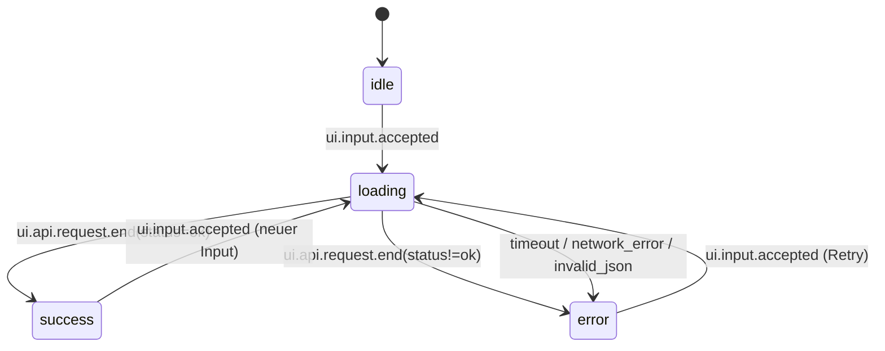

# BL-30.4.wp2 — Zustandsmodell + Interaktions-Contract v1 (dynamische UI-Flows)

## Kontext und Ziel

Dieses Dokument konkretisiert für **BL-30.4.wp2 / Issue #480** das verbindliche Zustands- und Interaktionsmodell für die HTML5-UI.
Es baut auf der Architekturentscheidung aus [`docs/gui/HTML5_UI_ARCHITECTURE_V1.md`](./HTML5_UI_ARCHITECTURE_V1.md) auf und bleibt **additiv** zum bestehenden API-Contract von `POST /analyze`.

Referenzen:
- Parent: #108
- Architektur-Basis (wp1): #479
- Runtime-/Contract-Gates: #6, #127

## 1) Zustandsmodell (Analyze-Flow)

Normative Analyze-States:
- `idle` — kein aktiver Request
- `loading` — Request läuft
- `success` — API-Response erfolgreich (`HTTP 2xx` + `ok=true`)
- `error` — API-/Netzwerk-/Validierungs-/Timeout-Fehler

Mermaid-State-Diagramm (v1):

Invarianten:
1. Jede Nutzeraktion für Analyze (`submit`, Kartenklick, Keyboard-Trigger) muss mit `ui.input.accepted` starten.
2. Jeder `loading`-State endet deterministisch in `success` oder `error` (kein permanentes Loading).
3. Pro Analyze-Lauf genau ein `ui.api.request.start` und genau ein `ui.api.request.end`.

## 2) Event-/Action-Contract (UI-Komponenten)

| Event | Quelle | Guard/Precondition | State-Transition | Side-Effects |
|---|---|---|---|---|
| `ui.interaction.form.submit` | Input-Form | Form submit | keine direkte Transition | Eingabe validieren, `query` extrahieren |
| `ui.validation.error` | Input-Form | `query` leer/ungültig | `* -> error` | Fehlerhinweis rendern, kein API-Call |
| `ui.interaction.map.analyze_trigger` | Map-Panel | gültige Koordinate aus Klick/Keyboard | keine direkte Transition | Marker setzen, Coordinate-Payload bauen |
| `ui.input.accepted` | Orchestrator (`startAnalyze`) | valide Payload | `idle/success/error -> loading` | neue `request_id`, UI resetten, Submit disablen |
| `ui.api.request.start` | API-Bridge (`runAnalyze`) | `loading` aktiv | bleibt `loading` | `POST /analyze`, Header `X-Request-Id`, `X-Session-Id` |
| `ui.api.request.end(status=ok)` | API-Bridge | Response `HTTP 2xx` + `ok=true` | `loading -> success` | Payload rendern, Faktoren extrahieren |
| `ui.api.request.end(status!=ok)` | API-Bridge | API-/HTTP-Fehler | `loading -> error` | Fehlerbox/Status setzen |
| `ui.state.transition` | State-Layer | bei jeder Analyze-Transition | gemäß Diagramm | strukturierte Telemetrie für UI→API-Korrelation |

Komponentenvertrag:
- **Input-Panel** liefert nur Input-Ereignisse (`query` oder `coordinates`) und enthält keine Fachlogik.
- **Map-Panel** liefert Interaktionsereignisse (klick/drag/zoom) und Analyze-Trigger, nicht aber fachliche Bewertung.
- **Result-Panel** projiziert API-Output read-only (`result.status`, `result.data`) und berechnet keine Scores lokal.

## 3) Debounce-/Cancel-/Concurrency-Regeln

v1-Regeln für robuste dynamische Flows:

1. **Single-Flight Analyze:** pro UI-Session genau ein aktiver Analyze-Request gleichzeitig (`loading` sperrt weiteren Submit-Button).
2. **Cancel per Timeout:** Requests werden clientseitig mit `AbortController` nach modeabhängigem Budget abgebrochen.
3. **Mode-Budgets:**
   - `basic`: `20s`
   - `extended`: `30s`
   - `risk`: `40s`
4. **Retry-Semantik:** Nutzerinitiierter Retry führt über denselben Transition-Pfad `error -> loading`.
5. **Keine stillen Parallel-Rennen:** neue Analyze-Ausführung wird erst nach terminalem Zustand (`success`/`error`) gestartet.

## 4) Fehler-/Timeout-/Retry-Strategie pro State

| State | Fehlerklasse | Verhalten | Nächster State |
|---|---|---|---|
| `loading` | `timeout` (`AbortController`) | Request abbrechen, strukturierte Fehlermeldung anzeigen (`timeout: ...`) | `error` |
| `loading` | `network_error` | API-Ende-Event mit Fehlerklasse loggen, Fehlerbox rendern | `error` |
| `loading` | `invalid_json` | Response als ungültig markieren, Diagnose im Panel | `error` |
| `loading` | `client_error`/`server_error` | API-Fehlercode/-message anzeigen | `error` |
| `error` | Nutzer startet neuen Run | Full Retry mit neuer `request_id` | `loading` |
| `success` | Nutzer startet neuen Run | Neuer Analyze-Lauf, alte Payload wird ersetzt | `loading` |

## 5) Additive Kompatibilität zu `POST /analyze`

Die UI bleibt strikt API-first und additiv kompatibel:

1. Request-Shape bleibt kompatibel zu `docs/api/contract-v1.md`:
   - Adresspfad: `{"query": "..."}`
   - Kartenpfad: `{"coordinates": {"lat": ..., "lon": ..., "snap_mode": "ch_bounds"}}`
   - additive Optionen (`intelligence_mode`, `timeout_seconds`, `options.response_mode`) bleiben optional.
2. Header-Korrelation ist additiv (`X-Request-Id`, `X-Session-Id`) und verändert keine Fachsemantik.
3. Ergebnisdarstellung konsumiert additive Felder tolerant (Forward-Compatibility), insbesondere Explainability-Pfade.
4. UI enthält keine Duplikation von Scoring-/Entitlement-Logik.

## 6) Referenz auf Implementierung (Ist-Stand)

Kanonischer Runtime-Pfad:
- `src/shared/gui_mvp.py`

Relevante Implementierungsanker:
- `setPhase(...)` + Event `ui.state.transition`
- `runAnalyze(...)` mit `AbortController` und `ui.api.request.start/end`
- `startAnalyze(...)` als zentraler Orchestrator (`ui.input.accepted`)
- `timeoutSecondsForMode(...)` für modeabhängige Timeout-Budgets

## 7) Nicht-Ziele (wp2)

- Keine Festlegung des Performance-Budgets/Caching-Messrahmens (kommt in #481).
- Keine finale UX-/Accessibility-Detailnorm für Explainability-Views (kommt in #482).
- Keine Erweiterung des Backend-Analyze-Vertrags über additive Felder hinaus.

## 8) Definition-of-Done-Check (#480)

- [x] Zustandsdiagramm + Event-Contract dokumentiert
- [x] Fehler-/Timeout-/Retry-Strategie pro State dokumentiert
- [x] Additive Kompatibilität zum bestehenden `/analyze`-Contract nachweisbar
- [x] Regressionstest für Pflichtsektionen/Referenzen ergänzt
