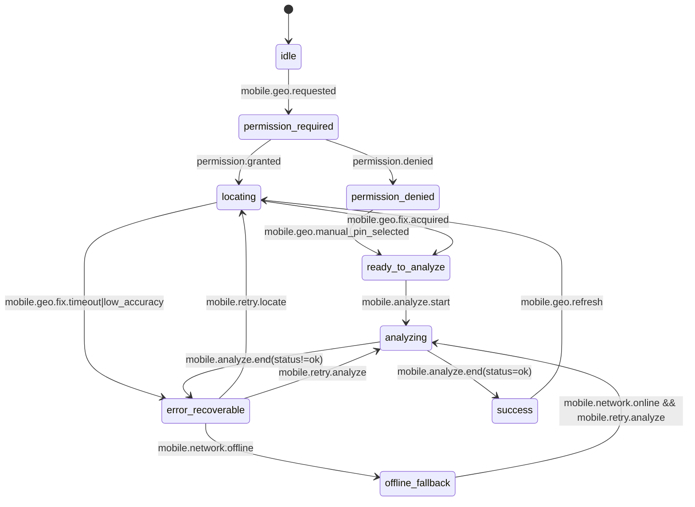

# BL-30.6.wp2 — Mobile Geolocation State-/Interaction-Contract v1 (Permission/Retry/Offline)

Bezug: [#113](https://github.com/nimeob/geo-ranking-ch/issues/113), [#503](https://github.com/nimeob/geo-ranking-ch/issues/503)

## 1) Ziel und Scope (v1)

Dieser Contract beschreibt den **UI-/State-Flow** für mobile Geolocation im Analyze-Prozess.
Er ergänzt den API-Rahmen aus [`docs/api/mobile-live-geolocation-contract-v1.md`](../api/mobile-live-geolocation-contract-v1.md), ohne den bestehenden `/analyze`-Contract zu brechen.

In Scope (wp2):
- deterministische Zustände + Übergänge für Permission, Locate, Analyze und Ergebnis
- verbindliche Retry-/Offline-Regeln für instabile oder fehlende Konnektivität
- UX-/Accessibility-Mindestkriterien für Mobile (Phone/Tablet)

Nicht in Scope (Folgearbeit):
- produktiver Telemetrie-/Privacy-Operationalisierungsstandard (siehe #504)
- OS-/Framework-spezifische UI-Implementierung (dieses Dokument bleibt plattformneutral)

## 2) Zustandsmodell (Permission + Locate + Analyze)

Normative Mobile-Geolocation-States:
- `idle` — kein aktiver Geolocation-/Analyze-Lauf
- `permission_required` — App hat noch keine freigegebene Location-Berechtigung
- `permission_denied` — Berechtigung explizit verweigert oder systemseitig blockiert
- `locating` — Gerät versucht Positionsfix (GPS/Fused)
- `ready_to_analyze` — verwertbare Position vorhanden, Analyze kann gestartet werden
- `analyzing` — Request zu `POST /analyze` läuft
- `success` — API-Antwort erfolgreich (`HTTP 2xx` + `ok=true`)
- `error_recoverable` — recoverable Fehler (timeout, low accuracy, network)
- `offline_fallback` — kein Netz, aber UI bleibt benutzbar mit letztem validen Standortkontext

Mermaid-State-Diagramm (v1):

Invarianten (verbindlich):
1. Jeder mobile Analyze-Run startet mit genau einem `mobile.analyze.start` und endet mit genau einem `mobile.analyze.end`.
2. `permission_denied` blockiert den Flow nicht dauerhaft: Manual-Pin oder textbasierte Eingabe bleibt möglich.
3. `offline_fallback` ist ein **funktionaler** Zustand (kein Dead-End): Nutzer kann offline weiterarbeiten und bei Netzrückkehr retryen.

## 3) Event-/Trigger-Contract (Permission/Retry/Offline)

| Event | Precondition | Transition | Pflicht-Side-Effect |
|---|---|---|---|
| `mobile.geo.requested` | User startet Geolocation-Flow | `idle -> permission_required` | Permission-Sheet oder erklärender Hinweis |
| `permission.granted` | OS meldet Freigabe | `permission_required -> locating` | Start Location-Provider, Ladeindikator |
| `permission.denied` | OS meldet Ablehnung | `permission_required -> permission_denied` | Deutlicher Hinweis + Alternativeingabe |
| `mobile.geo.fix.acquired` | Fix frisch/genau genug | `locating -> ready_to_analyze` | Standort-Metadaten für Analyze vorbereiten |
| `mobile.geo.fix.timeout` | kein Fix innerhalb Budget | `locating -> error_recoverable` | Fehlercode `locate_timeout`, Retry-CTA |
| `mobile.geo.fix.low_accuracy` | Accuracy außerhalb Budget | `locating -> error_recoverable` | Fehlercode `locate_low_accuracy`, Retry-CTA |
| `mobile.analyze.start` | Position oder Manual-Pin vorhanden | `ready_to_analyze -> analyzing` | Request mit `options.mobile_geolocation` senden |
| `mobile.analyze.end(status!=ok)` | HTTP-/API-Fehler | `analyzing -> error_recoverable` | Fehler-Panel + klarer Next-Step |
| `mobile.network.offline` | Konnektivität verloren | `error_recoverable -> offline_fallback` | Offline-Banner + Queue-Hinweis |
| `mobile.retry.analyze` | Netz verfügbar + letzte Payload vorhanden | `error_recoverable/offline_fallback -> analyzing` | idempotenter Analyze-Retry |

## 4) Retry-, Timeout- und Offline-Regeln

Verbindliche v1-Regeln:

1. **Retry-Budget Geolocation:** max. `2` automatische Locate-Retries vor Nutzerentscheidung.
2. **Retry-Budget Analyze:** max. `1` automatischer Analyze-Retry bei transienten Netzwerkfehlern; danach manueller Retry-CTA.
3. **Backoff:** linear (`1s`, `2s`) für Locate-Retries; kein aggressives Polling.
4. **Offline-Verhalten:**
   - letzter valider Standort darf read-only angezeigt werden (`stale` klar markieren),
   - keine stillen API-Repeats im Hintergrund,
   - Retry startet nur explizit per User-Interaktion oder bei dokumentierter Reconnect-Aktion.
5. **Timeout-Budgets (mobile defaults):**
   - Location-Fix: `10s`
   - Analyze-Request: `20s` (basic), `30s` (extended), `40s` (risk)

Deterministische Fehlerklassen für UI-Entscheide:
- `locate_timeout`
- `locate_low_accuracy`
- `permission_denied`
- `network_offline`
- `analyze_timeout`
- `analyze_http_error`

## 5) UX-/A11y-Mindestkriterien (Mobile)

Mindeststandard v1:
- **Klare Statussichtbarkeit:** Permission-/Locate-/Analyze-Status muss textlich sichtbar sein (nicht nur Icon/Farbe).
- **Touch + Keyboard:** zentrale Aktionen (`Retry`, `Use manual pin`, `Analyze`) per Touch und Keyboard erreichbar.
- **Screenreader-Basics:** State-Wechsel über `aria-live` oder äquivalenten Accessibility-Mechanismus ankündigen.
- **Fehlertexte mit Aktion:** jede Fehlermeldung enthält einen klaren nächsten Schritt (z. B. „Erneut versuchen", „Standort manuell setzen").
- **Offline-Indikator:** permanenter, unmissverständlicher Offline-Hinweis im Fallback-State.
- **Permission-Transparenz:** bei denied/prompt wird erklärt, warum Geolocation angefragt wird und welche Alternative möglich ist.

## 6) Kompatibilitäts- und Integrationsrahmen

- Dieser State-/Interaction-Contract bleibt additiv zum API-Contract aus [`docs/api/contract-v1.md`](../api/contract-v1.md).
- Mobile-Metadaten werden weiterhin über `options.mobile_geolocation` und `result.status.mobile_geolocation` geführt.
- Für GUI-Basisfluss und bestehende Analyze-State-Marker siehe [`docs/gui/GUI_MVP_STATE_FLOW.md`](./GUI_MVP_STATE_FLOW.md).
- Telemetrie-/Privacy-Härtung ist in #504 spezifiziert: [`docs/testing/MOBILE_GEOLOCATION_TRACE_PRIVACY_V1.md`](../testing/MOBILE_GEOLOCATION_TRACE_PRIVACY_V1.md).

## 7) Definition-of-Done-Check (#503)

- [x] Zustandsmodell mit Triggern, Events und Übergängen dokumentiert
- [x] Offline-/Low-connectivity Verhalten und Retry-Regeln festgelegt
- [x] UX-/A11y-Mindestkriterien für Mobile angegeben
- [x] Referenzen auf API-/GUI-Contract konsistent ergänzt
- [x] Regressions-Guard für Pflichtsektionen/Verlinkung ergänzt
