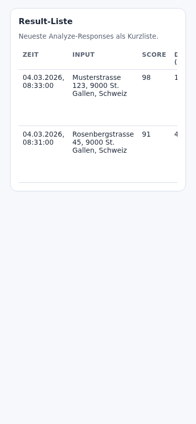
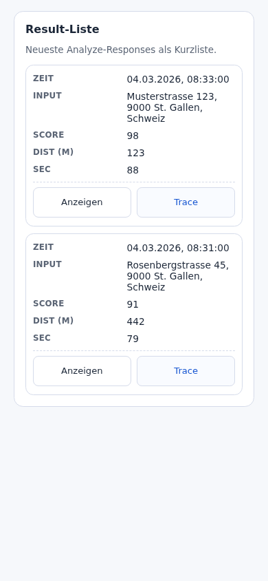

# GUI Result-Tabelle Mobile Overflow Fix (Issue #1142)

## Ziel

Auf Mobile-Viewports `<=390px` darf die Dev-Result-Tabelle keine Aktions-Controls abschneiden.
Die Tabelle muss ohne horizontalen Table-Scroll nutzbar bleiben.

## Umsetzung

Für `@media (max-width: 390px)` wurde die Tabellenansicht auf ein Card-/Label-Layout umgestellt:

- Tabellenkopf wird ausgeblendet (`thead` hidden)
- Jede Ergebniszeile wird als eigene Card gerendert
- Zellen nutzen `data-label` + `td::before` als Feldbezeichner
- Aktions-Buttons bleiben innerhalb der Card sichtbar (`Anzeigen`, `Trace`)

## Evidence (Before/After)

Viewport: `390x844` (Playwright, Chromium)

### Before (vor Fix)

- `shell.scrollWidth=498`, `shell.clientWidth=316`
- `allActionsVisible=false`
- Aktionsbuttons lagen rechts außerhalb des sichtbaren Bereichs



### After (nach Fix)

- `shell.scrollWidth=316`, `shell.clientWidth=316`
- `allActionsVisible=true`
- Aktionsbuttons vollständig sichtbar, kein horizontaler Table-Overflow



## Rohdaten

- `reports/evidence/issue-1142-mobile-overflow-evidence.json`

## Reproduktion (lokal)

```bash
# Harness-Seiten (before/after) liegen in /tmp, anschließend via Playwright-Core messen/screenshotten
node ./scripts/run_issue_1142_mobile_table_overflow_smoke.cjs
```

> Hinweis: Die Smoke nutzt `playwright-core` + lokales Chromium und schreibt Before/After-Screenshots sowie JSON-Metriken nach `reports/evidence/`.
